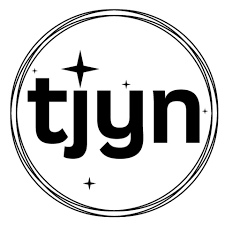

<!-------------------------------------------- START OF HTML ------------------------------------------->

  <h3>Climate Action Week 2021</h3> Climate Action Week rallies our people and communities to take collective climate action and secure a sustainable future for Singapore. In line with the Singapore Green Plan 2030, the theme this year is “City of Green Possibilities”.
  <!-- In 2020, more than 30 events were organised by our 3P partners during CAW.  This year, we once again welcome you to join us in organising climate initiatives to build an active green citizenry. -->
  <!-- Held from 12-18 July 2021, the objectives for Climate Action Week 2021 are to:
  - RAISE AWARENESS of climate adaptation and mitigation efforts by Public, Private and People sectors to support the Green Plan;
  - PARTNER communities and organisations to take concrete steps to realise net-zero emissions aspirations;
  - RALLY citizens to adopt a sustainable lifestyle, and be environmental stewards;
  - CO-CREATE solutions to achieve our climate pledge; and
  - EMPOWER stakeholders to enhance climate resilience. -->

<!-- NEWS -->
  <article class="main">
    <h4><strong>
NEWS
</strong></h4>
      <!-- 

        

          <h5><a href="url" class="external-link">Press Release on Climate Action Week </a></h5>
            
12 July

        

      

      

        

          <h5>Press Release on GreenGov.SG </h5>
            
12 July

        

      

      

        

        <h5><a href="" class="external-link">
        Join our Tiktok Face-off Challenge!</a></h5>
        

      
 -->
  </article>

<!-- EVENTS -->

  <section class="side">
    <h4><strong>
ONE-DAY EVENTS
</strong></h4>
        <!-- 

            

              
<strong><a href="" class="external-link">120 activities with over 60 partners. Click for full details.</a></strong>

            

        
 -->
      

        

          
          

              <h2><a href="https://form.gov.sg/#!/60d1572a67a33b0011b8f368" class="external-link">MSE - Partners for the Environment Forum 2021</a></h2>
              
12 July

          

        

<!-- test modal -->
<!-- test modal -->
        

          
          

            <h2>MBS - Climate Action Week Trainings</h2>
              
12 July

          

        

        

          
          

            <h2>Singapore Green Building Council Webinar on Climate Change Adaptation & Sustainability Leadership</h2>
              
13 July

          

        

        

          
          

            <!--  -->
            <h2>Grab - Regional Green Programme & JustGrab Green</h2>
            
14 July

          

              <!-- 

                

                  <h1>Grab - Regional Green Programme & JustGrab Green</h1>
                      The quick brown fox jumped over the lazy dog.The quick brown fox jumped over the lazy dog.The quick brown fox jumped over the lazy dog.The quick brown fox jumped over the lazy dog.The quick brown fox jumped over the lazy dog.The quick brown fox jumped over the lazy dog.The quick brown fox jumped over the lazy dog.   
                      The quick brown fox jumped over the lazy dog.The quick brown fox jumped over the lazy dog.The quick brown fox jumped over the lazy dog.The quick brown fox jumped over the lazy dog.The quick brown fox jumped over the lazy dog.
                        <a href="url"><h5>Click here to join the event</h5></a>
                  <a href="#modal-close" title="Close" class="modal-close">CLOSE &times;</a>
              

          
 -->
        

        

          
          

            <h2>Anchor Green Primary School - Climate Action Week school activity</h2>
              
13 July, 27 July

          

        

        

          
          

            <h2>SUTD seminar series on Sustainability and Circular Economy: The Role of Design in Circular Economy</h2>
              
14 July (till 28 July)

          

        

        

          
          

            <h2>WWF Singapore - Schools for Climate Action</h2>
              
14 July

          

        

        

          
          

            <h2>CDL - Launch of Climate Action Exhibition “Change the Present, Save the Future”</h2>
              
14 July

          

        

        

          
          

            <h2>Ricoh Asia Pacific - Internal Outreach - "Facing Our Foodprint"</h2>
              
15 July

          

        

        

          
          

            <h2>Forum for Sustainable Procurement - National Sustainable Procurement Roundtable (DBS, Mandai Park Holdings, Singtel and Starhub)</h2>
              
16 July

          

        

        

          
          

            <h2>WWF Singapore - Launch of Kosong Plan</h2>
              
15 July

          

        

        

          
          

            <h2>Singapore Green Building Council - Joint Webinar with HDB-BRI on Smart & Sustainable Living</h2>
              
15 July

          

        

        

          
          

            <h2>Energy Studies Institute, NUS - Singapore Green Plan 2030 Conversation</h2>
              
16 July

          

        

        

          
          

            <h2>NTU Earth Observatory of Singapore - ‘Ask a Scientist: Climate Change and Nature-Based Solutions</h2>
              
16 July

          

        

        

          
          

            <h2>Fengshan Primary School Environmental Committee - "Adopt an edible plant"</h2>
              
16 July

          

        

        

          
          

            <h2>Secondsguru - "Can I be a changemaker?" Real stories from current times</h2>
              
17 July

          

        

        

          
          

            <h2>The Eco-Statement - Game of Recycling - A game-based workshop on recycling</h2>
              
17 July

          

        

        

          
          

            <h2>Temasek Poly Green Interest Student Group & Rivervale Court Residents’ Network - Workshop on upcycling</h2>
              
17 July

          

        

        

          
          

            <h2>Earth 300 - Earth 300 Initiative online conference</h2>
              
17 July

          

        

        

          
          

            <h2>Singapore Youth for Climate Action - "A Voice for Mother Nature" online event</h2>
              
17 July

          

        

        

            
            

              <h2>Port of Singapore Authority (PSA) - Green Port Conversation “Energy Resilience for Sustainable Growth – Strategies and Challenges for Singapore and the Industries” </h2>
                
13 July

            

          

        

        <!-- SECOND OVERFLOW FOR WEEK-LONG EVENTS -->
        <h4><strong>
WEEK-LONG EVENTS
</strong></h4>
          

          

            
            

              <h2>Nanyang Girls High School - Plastic bottle collection competition, upcycling competition, sustainable lifestyle and zero-waste programmes</h2>
                
12-18 July

            

          

          

            
            

              <h2>Tampines North Primary School - Love Our Food</h2>
                
12-18 July

            

          

          

            
            

              <h2>Qihua Primary School - Green Wave & Virtual Eco-tour/sharing</h2>
                
12-18 July

            

          

          

            
            

              <h2>Punggol Primary School - Clean Plate Challenge during mealtimes</h2>
                
12-18 July

            

          

          

            
            

              <h2>Woodgrove Primary School - Event on "Vampire Appliances"</h2>
                
12-18 July

            

          

          

            
            

              <h2>Kuo Chuan Presbyterian Primary School - Various events with hands-on activities</h2>
                
12-18 July

            

          

          

            
            

              <h2>Sembawang Primary School - Sharing on sustainable practices and zero waste lifestyle habits </h2>
                
12-18 July

            

          

          

            
            

              <h2>East Spring Primary School - Clean Plate Campaign and Earth Week</h2>
                
12-18 July

            

          

          

            
            

              <h2>Towner Gardens School (MINDS) - Edible Gardening</h2>
                
12-18 July

            

          

          

            
            

              <h2>Fengshan Primary School (FSPS) Environmental Committee - Urban Farming Programmes</h2>
                
12-18 July

            

          

          

            
            

              <h2>Ai Tong School - Climate Action Wall</h2>
                
12-18 July

            

          

          

            
            

              <h2>Republic Polytechnic - Sustainable Living - Reduce waste and consumption, Reverse Vending Machine</h2>
                
April - September 2021

            

          

          

            
            

              <h2>South-West Community Development Council (SWCDC) - Cooking Class for Community Gardeners, Green Schools Assembly Skit, Energy Conservation Posters by Junior Environment Ambassadors</h2>
                
12-16 July

            

          

          

            
            

              <h2>PA (MacPherson) & SembWaste - Cash-for-Trash Station for residents to bring down their recyclables</h2>
                
3 July (1st Saturday of every month)

            

          

          

            
            

              <h2>Taman Jurong Youth Network - Taman Jurong Eco Series </h2>
                
1-30 July

            

          

          

          
          
            

              <h2>Singapore Youth for Climate Action & Temasek Polytechnic student group campaigns - "Our Fight Against Dengue" & "Reducing Energy Consumption"</h2>
                
12-18 July

            

          

          

            
            

              <h2>Just Dabao & SusGain - "Just Plant!" campaign on tree-planting and reforestation</h2>
                
From 12 July

            

          

          

            
            

              <h2>Shimizu Corporation - Annual Tree Planting 2021 and "Bring Your Own" campaign</h2>
                
12-18 July

            

          

          

          
            

              <h2>Singapore Green Building Council - Digital Activation for SGBC Green Homes Public Engagement Campaign</h2>
                
12-16 July

            

          

          

          
            

              <h2>Ricoh Asia Pacific - Facing our Footprint - Social Media Outreach</h2>
                
5-25 July

            

          

          

            
            

              <h2>Micron - Climate Action Week Campaign</h2>
                
12-18 July

            

          

          

            
            

              <h2>The Ritz-Carlton, Millenia Singapore - Clean Plate Challenge</h2>
                
12-18 July

            

          

          

            
            

              <h2>Novotel Hotel - Promotional Menu & Green deals</h2>
                
12-18 July

            

          

          

            
            

              <h2>Swissôtel Merchant Court - Herb Garden Showcase, staff outreach and Ellenborough Market Cafe outreach</h2>
                
12-18 July

            

          

          

            
            

              <h2>Swapaholic - Publishing of Textile Sustainability Report</h2>
                
12-18 July

            

          

          

            
            

              <h2>Port of Singapore Authority (PSA) - e-Waste Recycling Drive, Sustainability Champion Video Cascade, ENView Issue 9, and launch of Singapore Sustainability Narrative infographic </h2>
                
12-18 July

            

          

      

              <!-- END OF SECOND OVERFLOW -->
  </section>

<!-- RESOURCES -->

   <section class="side">
    <h4><strong>
RESOURCES
</strong></h4>
      

        

          <h5>
<a href="../resources/caw-banners-posters.zip" class="external-link" >Help Publicise Climate Action Week </a>
</h5>
        

      

      

        

          <h5><a href="https://www.mse.gov.sg/take-action/individuals" class="external-link">Take Action Today</a></h5>
        

      

      

        

          <h5><a href="http://greenplan.gov.sg/" class="external-link">Join the Green Plan </a></h5>
        

      

      

        

          <h5><a href="https://www.mse.gov.sg/resources/" class="external-link">View More Resources </a></h5>
        

      

  </section>

