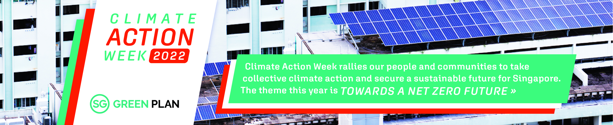
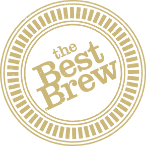
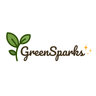
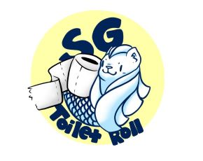
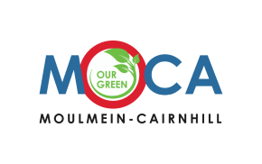

<!-------------------------------------------- START OF HTML ------------------------------------------->

<!-- NEWS -->
  <article class="main">
    <h4><strong>
NEWS
</strong></h4>
      

        

          <h5><a href="#" class="external-link">Press Release on Climate Action Week </a></h5>
            
19 Sep

        

      

      

        

          <h5><a href="#" class="external-link">Speech by Ms Grace Fu at the Partners for the Environment Forum </a></h5>
            
19 Sep

        

      

      

        

          <h5><a href="#" class="external-link">12 exciting ways to get in on the climate action</a></h5>
            
19 Sep

        

      

       

        

          <h5><a href="#" class="external-link">Article #2</a></h5>
            
19 Sep

        

      
   
  </article>

<!-- EVENTS -->

  <section class="side">
    <h4><strong>
HIGHLIGHTS
</strong></h4>
        

            

                <strong>XX partners organised over XX activities during Climate Action Week this year!</strong>
              <a class="button_caw" href="../resources/CAW_Events_2022.pdf" target="_blank">See Full Programme</a>
            

        

      
  
        

          
          

            <h2><a href="https://nus-etp.my.canva.site/nus-isi-caw-2022" class="external-link" target="_blank">NUS Enterprise - Panel on how social entrepreneurs can shape the climate response</a></h2>
              
19 Sep

          

        
                  
        

          
          

            <h2><a href="#" class="external-link" target="_blank">Palo IT - Circular Venture Design Workshop</a></h2>
              
19 Sep

          

        

        

          
          

              <h2>The Best Brew - Grounds For Your Garden</h2>
              
19 Sep

          

        

        

          
          

            <h2><a href="https://forms.gle/z8i9BRS6HaCdvg2R8" class="external-link" target="_blank">Chemistry - Circular Design and Business Modelling Course Preview</a></h2>
              
19 Sep

          

        

  

           
          

            <h2><a href="https://docs.google.com/forms/d/e/1FAIpQLSfULliF2WJiujqRfQMbKFmkcYcdxpuXKJtFVGd1AKxZo8Npyg/viewform" class="external-link" target="_blank">Edible Garden City - Regenerative Growing at Home and Its Benefits</a></h2>
              
19 Sep

          

        

       

          
          

            <h2><a href="https://www.theplasticproject.sg/program" class="external-link" target="_blank">The Plastic Project – Introduction to Plastics workshop</a></h2>
              
20 Sep

          

          

        

          
          

            <h2><a href="https://nus-etp.my.canva.site/nus-isi-caw-2022" class="external-link" target="_blank">NUS Enterprise - Why so SUS? A Sustainability Meet Up</a></h2>
              
20 Sep

          

        
                    
        

          
          

            <h2><a href="https://events.eco-business.com/flagship-events/unlocking-capital-for-sustainability-2022#about" class="external-link" target="_blank">Eco Business - Unlocking capital for sustainability 2022: The role of sustainable finance in a disrupted world</a></h2>
              
21 Sep

          

        

        

          
          

            <h2><a href="https://bethechange.fashion/" class="external-link" target="_blank">Textile and Fashion Federation (Singapore) - Circular & Sustainable Fashion Virtual Seminar</a></h2>
              
21 Sep

          

        

        

          
          

            <h2><a href="https://www.nyc.gov.sg/en/initiatives/programmes/national-youth-dialogues" class="external-link" target="_blank">National Youth Council - National Youth Dialogue</a></h2>
              
21 Sep

          

        

        

          
          

            <h2><a href="https://www.gardensbythebay.com.sg/en/things-to-do/calendar-of-events/wonderful-wetlands.html" class="external-link" target="_blank">Gardens by the Bay - Webinar on blue carbon and coastal ecosystems</a></h2>
              
21 Sep

          

        

        

          
          

            <h2><a href="https://www.eventbrite.sg/e/driving-carbon-reduction-sustainable-transformation-through-supply-chain-tickets-411075657357" class="external-link" target="_blank">Sustainable Procurement Pledge Singapore Chapter - Driving carbon reduction and sustainable transformation through supply chain in Singapore and its region</a></h2>
              
21 Sep

          

        

        

          
          

            <h2><a href="https://docs.google.com/forms/d/16NHfPrb6tmVO0xd4EN8aO88AhGMBzovkGxzNo3b03kU/edit" class="external-link" target="_blank">Carb0n.fi - PALO IT & Carb0n.fi Panel Discussion - Tech4Earth: Friend or Foe?</a></h2>
              
22 Sep

          

        

        

          
          

            <h2><a href="http://go.gov.sg/caw2022tour" class="external-link" target="_blank">National Environment Agency - Visit to Tuas South Incineration Plant</a></h2>
              
23 Sep

          

        
           
        

          
          

            <h2><a href="https://nus-etp.my.canva.site/nus-isi-caw-2022" class="external-link" target="_blank">NUS Enterprise - Debate on innovation to reverse the effects of climate change</a></h2>
              
23 Sep

          

        
              
        

          
          

            <h2><a href="https://docs.google.com/forms/d/e/1FAIpQLSd_08MGKOHLZBQwPnl2wMg6y5ExYKwILgFBR5gJIzcu9fpjFQ/viewform?usp=pp_url" class="external-link" target="_blank">NTU GreenSparks - Climate Justice Dialogue</a></h2>
              
23 Sep

          

        

        

          
          

            <h2><a href="https://www.smusa.sg/sustainability" class="external-link" target="_blank">Singapore Management University - Fireside Chat: Towards Net Zero</a></h2>
              
23 Sep

          

        
                
        

          
          

            <h2><a href="https://docs.google.com/forms/d/16NHfPrb6tmVO0xd4EN8aO88AhGMBzovkGxzNo3b03kU" class="external-link" target="_blank">Carb0n.fi - The Plastic Project Singapore Workshop and the InOut Atelier Terrarium Workshop</a></h2>
              
23 Sep

          

        

         

          
          

            <h2><a href="https://forms.gle/c9jCsG37Rqf7qaQM8" class="external-link" target="_blank">Toilet Roll SG - Climate Action Week with Toilet Roll SG & NUS SAVE</a></h2>
              
24 Sep

          

        

        

          
          

            <h2><a href="https://bit.ly/cleancairnhill" class="external-link" target="_blank">Our Green MoCa (Moulmein-Cairnhill) - Keep Pek Kio Clean Exhibition and Keep Cairnhill Clean Event</a></h2>
              
24 Sep

          

        

        

          
          

            <h2><a href="#" class="external-link" target="_blank">City Developments Limited - Youth4Climate Concert</a></h2>
              
24 Sep

          

        

          

          
          

            <h2><a href="https://www.eventbrite.sg/e/climate-fresk-palo-it-climate-action-week-tickets-403330050037" class="external-link" target="_blank">Palo-IT Singapore - Climate Fresk Workshop (for adults & kids)</a></h2>
              
24 Sep

          

        

         

          
          

            <h2><a href="https://www.eventbrite.sg/e/digital-collage-palo-it-climate-action-week-tickets-401549925637" class="external-link" target="_blank">Palo-IT Singapore - Digital Collage Workshop</a></h2>
              
24 Sep

          

        

        

          
          

            <h2><a href="https://docs.google.com/forms/d/e/1FAIpQLSe_rRD9fqjhec93YgaQH49Z1Qlh47Gf71SasdzCQH0og3jQZA/viewform" class="external-link" target="_blank">Ground-Up Initiative - Balik Kampung @ Ground-Up Initiative - Farming activities</a></h2>
              
24 Sep

          

        

        

          
          

            <h2><a href="https://bethechange.fashion/" class="external-link" target="_blank">Textile and Fashion Federation (Singapore) - Upcycling Workshop</a></h2>
              
24 Sep

          

        

          

          
          

            <h2><a href="https://www.gardensbythebay.com.sg/en/things-to-do/calendar-of-events/wonderful-wetlands.html" class="external-link" target="_blank">Gardens by the Bay - Mangrove monitoring</a></h2>
              
24 Sep

          

        
          

         

          
          

            <h2>Sport Singapore - Shoe Recycling Drive at Hougang Sport Centre</h2>
              
24 Sep

          

        

        

          
          

            <h2>West Coast Constituency Office - Cash-For-Trash @ West Coast Heights RN</h2>
              
24 Sep

          

        

        

          
          

            <h2><a href="https://go.gov.sg/succulent24sep2022" class="external-link" target="_blank">West Coast Constituency Office - Succulent in an Open Terrarium Workshop</a></h2>
              
24 Sep

          

        

          

          
          

            <h2><a href="https://go.gov.sg/cw24sep2022" class="external-link" target="_blank">West Coast Constituency Office - Confidence on Wheels Programme</a></h2>
              
24 Sep

          

        

         

          
          

            <h2><a href="https://go.gov.sg/owclstorytelling-westcoastcc" class="external-link" target="_blank">West Coast Constituency Office - Hybrid Storytelling by Our West Coast Library (OWCL) - Little Turtle and the Sea by Becky Davies</a></h2>
              
24 Sep

          

        
      
           <!-- FIRST OVERFLOW FOR WEEK-LONG EVENTS -->       
        

      
      
      
        <!-- SECOND OVERFLOW FOR WEEK-LONG EVENTS -->
        <h4><strong>
WEEK-LONG EVENTS
</strong></h4>
          

          

            
            

              <h2><a href="https://www.facebook.com/ourtanjongpagar" class="external-link" target="_blank">Tanjong Pagar Town Council - My Climate Action</a></h2>
                
22 Aug - 25 Sep

            

          

       
              
        

          
          

            <h2><a href="https://www.smusa.sg/sustainability" class="external-link" target="_blank">Singapore Management University - Book Donation Drive — Old Books, New Stories</a></h2>
              
21-23 Sep

          

        
                 
           

          
          

            <h2><a href="https://www.smusa.sg/sustainability" class="external-link" target="_blank">Singapore Management University - Pop-up Fashion Waste Recycling Station</a></h2>
              
21-23 Sep

          

        
              
          

          
          

            <h2><a href="https://www.smusa.sg/sustainability" class="external-link" target="_blank">Singapore Management University - The Zero Market 
— Booths for Sustainability Products and Activities</a></h2>
              
21-23 Sep

          

        
      
    
              <!-- END OF SECOND OVERFLOW -->
      

  </section>

<!-- RESOURCES -->

   <section class="side">
    <h4><strong>
RESOURCES
</strong></h4>
      

        

          
<h5><a href="../resources/caw-banners-posters.zip" class="external-link" >Help Publicise Climate Action Week </a></h5>

        

      

      

        

          
<h5><a href="https://www.mse.gov.sg/take-action/individuals" class="external-link">Take Action Today</a></h5>

        

      

      

        

          
<h5><a href="http://greenplan.gov.sg/" class="external-link">Join the Green Plan </a></h5>

        

      

      

        

          
<h5><a href="https://www.mse.gov.sg/resources/" class="external-link">View More Resources </a></h5>

        

      

  </section>

