

<h1>Our Journey</h1>

    

    

      

        

          

            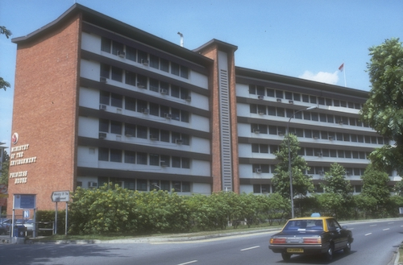
            

              

                1972
              

            

          

          

                <h2>Formation of Ministry of Environment</h2>
            
On 16 September 1972, the Ministry of the Environment (ENV) was set up to tackle issues such as pollution control, sewerage, drainage and environmental health. The ENV office was located at Princess House. 

          

          

        

      

      

        

          

            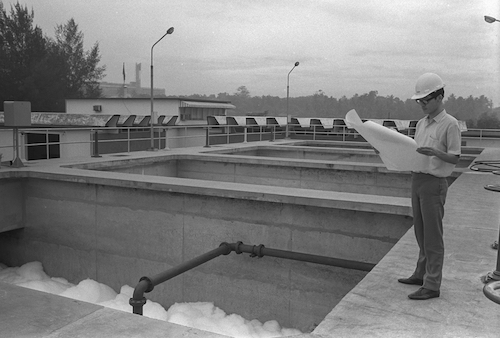
            

              

                1972
              

            

          

          

              <h2>Drafting of Singapore's Water and Sewerage Master Plans</h2>
            
The Sewerage Masterplan was first formulated in 1972, kicking off the development of Singapore's sewerage infrastructure. In the same year, Singapore's first Water Master Plan was also drawn up. The plan outlined strategies for water resources to ensure a diversified and adequate supply that could meet future requirements.

          

        

      

      

        

          

            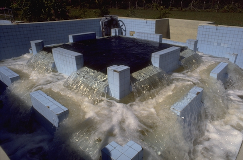
            

              

                1974
              

            

          

          

              <h2>Completion of Singapore's Pilot Water Reclamation Plant</h2>
            
In October 1974, Singapore’s first pilot water reclamation plant, a joint project by the Public Utilities Board (PUB) and the ENV, was commissioned at the Jurong Industrial Waterworks.

          

        

      

	      

        

          

            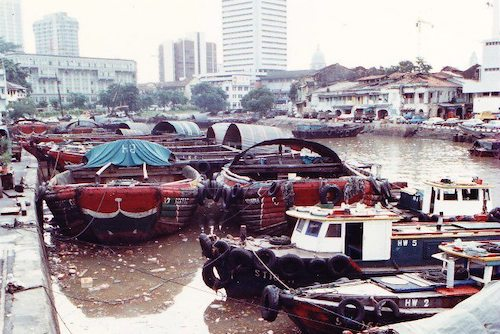
            

              

                1977
              

            

          

          

              <h2>Launch of the Singapore River Clean-Up</h2>
            
The clean-up of Singapore River and Kallang Basin commenced in 1977. Besides the physical cleaning of the heavily polluted rivers, the massive exercise also involved the removal of various sources of pollution, the provision of proper sewage infrastructure and new facilities for resettled residents and businesses, and the implementation of anti-pollution measures to minimise future pollution.

          

        

      

	          

        

          

            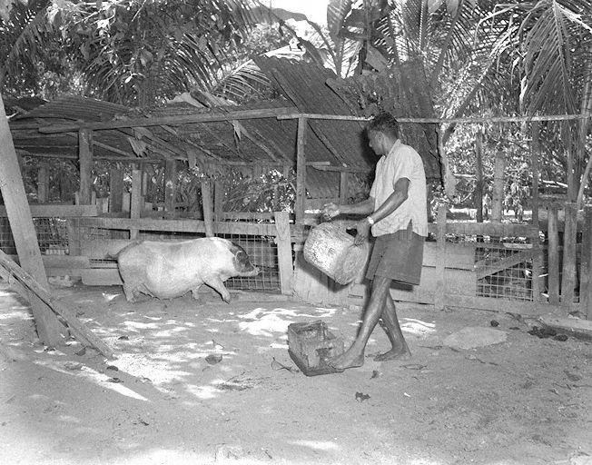
            

              

                1977
              

            

          

          

              <h2>Commencement of resettlement of farmlands</h2>
            
In the 1970s, rapid development brought about more employment opportunities and farmland was redirected to other uses. From 1977, pig farming was banned in water catchment areas such as Kranji, as well as Kallang and Singapore River basins. With intensive pig farming estates being developed at Punggol and Jalan Kayu, farmers who were more productive were given the option of relocation.

          

        

      

  

        

          

            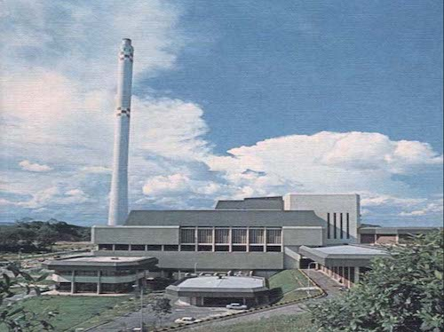
            

              

                1979
              

            

          

          

              <h2>Opening of Singapore's First Incineration Plant</h2>
            
Faced with a shortage of land for landfilling, Singapore took a bold step to build the first waste-to-energy (WTE) plant in Southeast Asia. On 30 July 1979, Singapore’s first WTE plant - Ulu Pandan Incineration Plant - was completed at a cost of $130 million, a hefty investment at the time.

          

        

      

	  

        

          

            
            

              

                1982
              

            

          

          

              <h2>Singapore Declared 'Malaria-Free'</h2>
            
Singapore was declared malaria-free by the World Health Organization (WHO) on 22 November 1982.

          

        

      

	      

        

          

            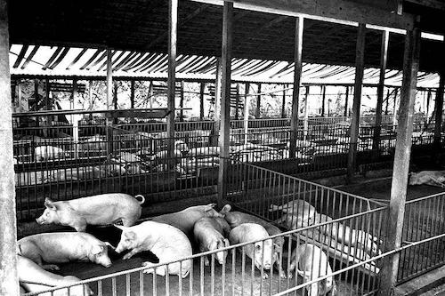
            

              

                1984
              

            

          

          

              <h2>Phasing out of pig farming</h2>
            
Pig farming was gradually phased out from 1984, after it was concluded that pig farming caused massive pollution and required intensive use of land and water – scarce resources in Singapore. It was also expensive to treat pig wastes. The phasing out of pig farming was completed in 1989.

          

        

      

	      

        

          

            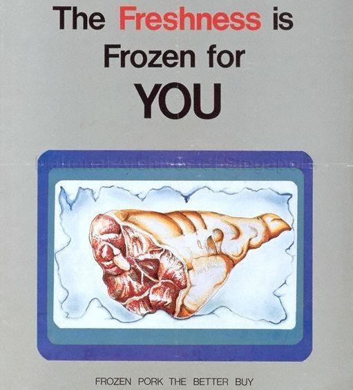
            

              

                1985
              

            

          

          

              <h2>Eat Frozen Pork’ Campaign</h2>
            
In the lead-up to the complete phasing-out of pig farming in Singapore, the “Eat Frozen Pork Campaign” debuted in 1985 to dispel common misconceptions on frozen pork and raise public awareness of the production, handling, quality and nutritional value of frozen pork. 

          

        

      

	      

        

          

            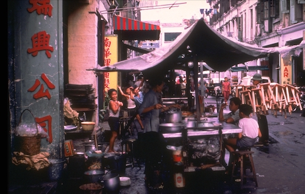
            

              

                1986
              

            

          

          

              <h2>Completion of Street Hawker Resettlement</h2>
            
From 1968 to 1986, the Government licensed and resettled street hawkers into purpose-built hawker centres and markets with proper sanitation and amenities. By February 1986, the resettlement work was completed and 18,000 street hawkers were re-sited into newly built hawker centres.

          

        

      

	      

        

          

            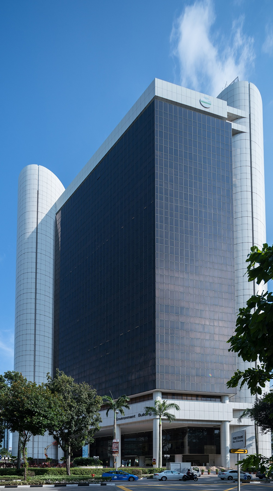
            

              

                1986
              

            

          

          

              <h2>Completion of 25-storey Environment Building</h2>
            
The Environment building is the first government building designed and drafted by the Public Works Department with the aid of a computer.
The $92.6 million building’s key was handed to ENV’s then Permanent Secretary, Mr Cheong Quee Wah, on 18 December 1986.

          

        

      

	      

        

          

            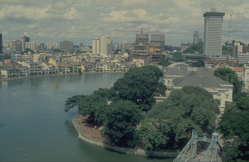
            

              

                1987
              

            

          

          

              <h2>Completion of the Singapore River Clean-Up</h2>
            
The decade-long clean-up of Singapore River was completed on 2 September 1987.

          

        

      

	    
	    
	      

        

          

            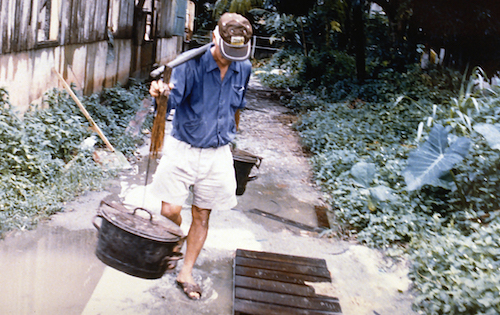
            

              

                1987
              

            

          

          

              <h2>Phasing Out of the Nightsoil Bucket</h2>
            
On 24 January 1987, Singapore bid goodbye to the century-old night soil bucket system. That day, the last night soil collection centre, located at Lorong Halus, ceased operation for good, as Singapore entered a new era served by a modern sanitation system.

          

        

      
	
	    

        

          

            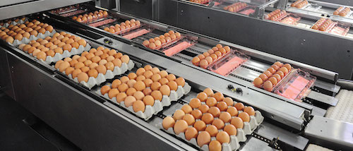
            

              

                1989
              

            

          

          

              <h2>Opening of Agrotechnology Parks in Lim Chu Kang and Loyang</h2>
            
Agricultural land continued to decline in the 1980s due to urbanisation. To maintain a degree of self-sufficiency and to maximise land productivity, PPD consolidated farming in Agrotechnology Parks. Mechanised and automated farm systems were promoted, boosting productivity in a tightening labour market.

          

        

      
	
	    
	    
	      

        

          

            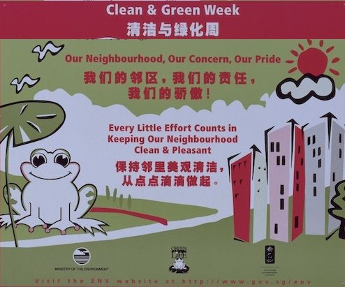
            

              

                1990
              

            

          

          

              <h2>Singapore's First Annual Clean and Green Week</h2>
            
Launched on 4 November 1990, the Clean and Green Week was a campaign to create awareness among Singaporeans that everyone is responsible for the environment. It became a yearlong campaign in 2007 and was consequently renamed Clean and Green Singapore.

          

        

      
	 
	    
	    
	      

        

          

            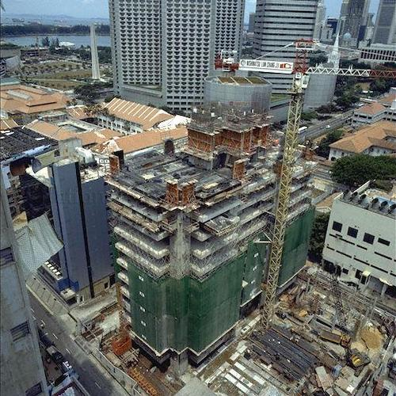
            

              

                1991
              

            

          

          

              <h2>Introduction of Policies on Pollution and Public Health</h2>
            
In 1991, ENV introduced the (i) Pollutant Standards Index (PSI) (ii) emissions standards for diesel vehicles and implemented (iii) the Environment Public Health (Control of Noise from Construction Sites) Regulation that capped noise levels at construction sites.

          

        

      
	
	    
	    
	      

        

          

            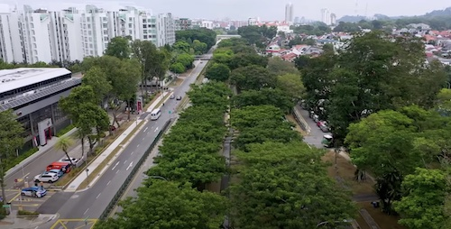
            

              

                1991
              

            

          

          

              <h2>Opening of the Bukit Timah Second Diversion Canal</h2>
            
The Bukit Timah Second Diversion Canal was constructed in 1991 to divert stormwater from the Bukit Timah Canal to the Kallang River. Subsidiary canals were also built to allow stormwater to flow more efficiently.

          

        

      

	    
	    
	      

        

          

            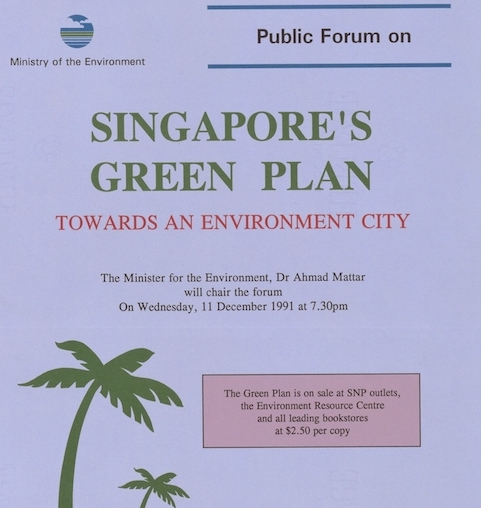
            

              

                1992
              

            

          

          

              <h2>Launch of Singapore's First Green Plan</h2>
            
The Singapore Green Plan is Singapore's first environmental blueprint. Released in May 1992 by ENV, its objective is to ensure that Singapore could develop an economic growth model that does not compromise its environment.

          

        

      

	    
	    
	      

        

          

            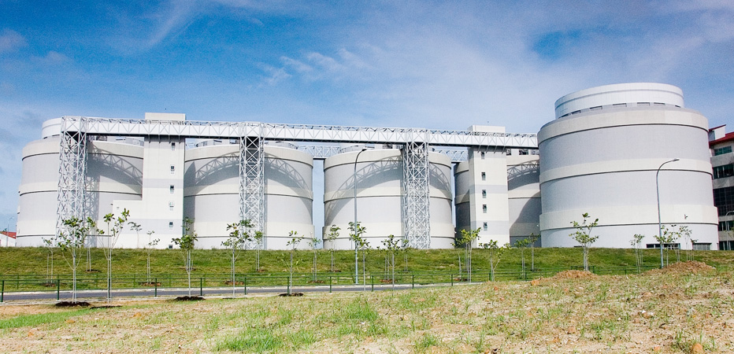
            

              

                1997
              

            

          

          

              <h2>Singapore Fully Served by Modern Sanitation</h2>
            
By 1997, all of Singapore had access to modern sanitation. In comparison, just 32 years ago when Singapore became independent in 1965, only 45% of the population had access to proper sanitation.

          

        

      

	      

        

          

            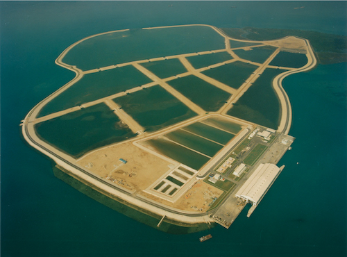
            

              

                1999
              

            

          

          

              <h2>Commencement of Semakau Landfill Operations (Phase 1)</h2>
            
With space running out at Singapore’s last inland dumping ground at Lorong Halus, and competition for land was getting increasingly intense with rapid urbanisation, Singapore’s first offshore landfill - Semakau Landfill - began its operations on 1 April 1999. Not only does this 3.5 square-kilometre island hold the trash generated by Singapore, it is also home to a thriving biodiversity and the waters around it support some of Singapore’s richest coral reefs.

          

        

      

        

          

            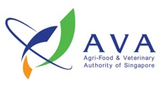
            

              

                2000
              

            

          

          

              <h2>Formation of Agri-Food & Veterinary Authority (AVA)</h2>
            
PPD was restructured into a statutory board, the Agri-Food and Veterinary Authority (AVA) on 1 April 2000 to address the increasingly challenging task of maintaining Singapore’s high standards of food safety, as well as animal and plant health.

          

        

      
		    
	    	    
	    
	    

        

          

            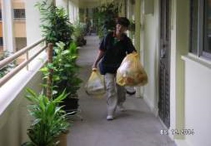
            

              

                2001
              

            

          

          

              <h2>Launch of Singapore's National Recycling Programme</h2>
            
Launched in April 2001, the National Recycling Programme (NRP) required the public waste collectors (PWCs) licensed by NEA to provide recycling bins and recycling collection services to all HDB estates, private landed properties and condominiums/private apartments opted into the public waste collection scheme. The NRP adopted a collection system in which paper, plastic, glass and metal recyclables were collected for recycling. Recycling bags were used for HDB and only bins/bags were used for landed properties.

          

        

      

	    

        

          

            
            

              

                2001
              

            

          

          

              <h2>Reconstitution of PUB</h2>
            
Recognising that Singapore’s water catchment and supply systems, drainage systems, water reclamation plants, and sewerage systems are part of a comprehensive water cycle, PUB was reconstituted to become Singapore’s national water authority, overseeing the entire water loop. The drainage and sewerage departments from ENV were transferred to PUB, while PUB itself was transferred from the Ministry of Trade and Industry to ENV.

          

        

      

        

          

            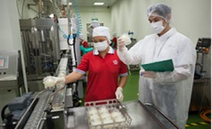
            

              

                2002
              

            

          

          

              <h2>Addition of Food Control Division</h2>
            
Formerly part of the Ministry of the Environment, the Food Control Division was moved to AVA. This allowed AVA to regulate the safety of both fresh produce and processed food from production right up to just before retail.

          

        

      
		    
	    

        

          

            
            

              

                2002
              

            

          

          

              <h2>Launch of Food Safety Public Awareness programme on foodborne diseases</h2>
            
The Food Safety Public Awareness programme was launched to educate consumers on how to better protect themselves against foodborne diseases. As part of the programme, a food safety mascot – Oscar the Food Safety Otter – was introduced.

          

        

      
		    
	    

        

          

            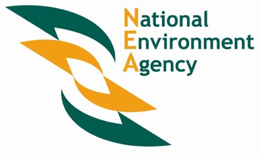
            

              

                2002
              

            

          

          

              <h2>Formation of National Environment Agency</h2>
            
On 1 July 2002, a new statutory board – the National Environment Agency (NEA) – was formed under ENV to focus on the implementation of environmental policies. It took on the operations of the Environmental Public Health Division, and the Environmental Policy and Management Division of ENV.

          

        

      

	    

        

          

            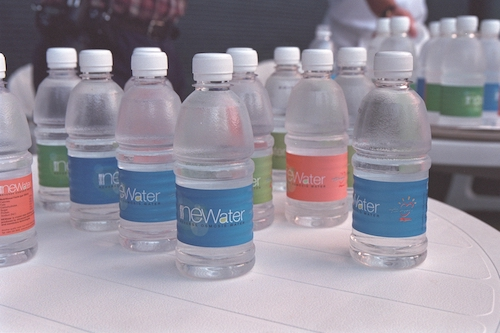
            

              

                2002
              

            

          

          

              <h2>Launch of NEWater</h2>
            
On 9 August 2002, 60,000 people toasted the nation’s birthday at the National Day Parade with bottles of NEWater. The following year, on 23 February 2003, then-Prime Minister Goh Chok Tong officially launched the NEWater Visitor Centre and the first NEWater Factory at Bedok. NEWater also became one of Singapore's Four National Taps.

          

        

      

        

          

            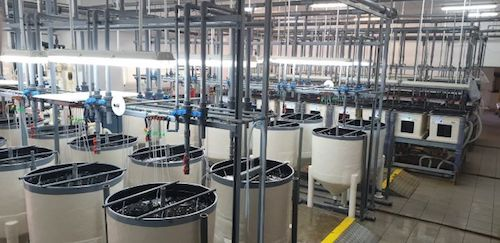
            

              

                2003
              

            

          

          

              <h2>Launch of Marine Aquaculture Centre</h2>
            
The Marine Aquaculture Centre was established on St. John’s Island with the aim to research on and develop technology in tropical marine food-fish aquaculture as well as play a role in increasing Singapore’s annual fresh fish consumption.

          

        

      
		    
	    
	    

        

          

            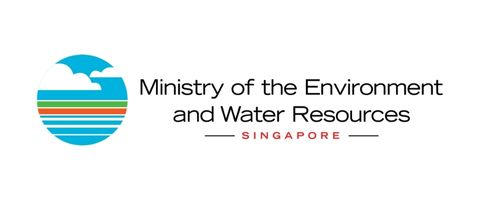
            

              

                2004
              

            

          

          

              <h2>ENV was renamed MEWR</h2>
            
In September 2004, ENV was renamed the Ministry of the Environment and Water Resources (MEWR) to better reflect the Ministry’s significantly expanded role in managing Singapore’s water resources.

          

        

      
	    

        

          

            
            

              

                2005
              

            

          

          

              <h2>Creation of Water Wally as PUB's mascot</h2>
            
PUB's mascot, Water Wally, was unveiled on 4 Aug 2005. An expert on everything about water, Water Wally is a mascot on a mission – to stop any abuse of our precious water resources and share the message of water conservation.

          

        

      
		    
	    

        

          

            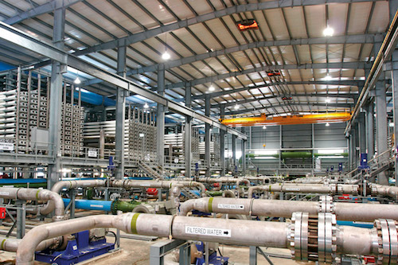
            

              

                2005
              

            

          

          

              <h2>Opening of Singapore's First Desalination Plant</h2>
            
On 13 September 2005, the SingSpring Desalination Plant - Singapore's first desalination plant for water supply and the largest seawater reverse-osmosis plant in the world - opened in Tuas. The plant can produce 30 million gallons of potable water per day.

          

        

      
	
	    

        

          

            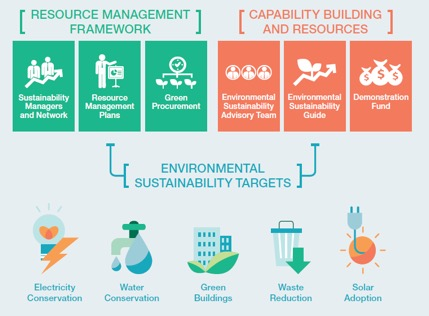
            

              

                2006
              

            

          

          

              <h2>Launch of Singapore's PSTLES Initiative</h2>
            
Introduced in 2006, the Public Sector Taking the Lead in Environmental Sustainability (PSTLES) initiative encouraged agencies to focus on sustainability outcomes and put in place organisational processes to drive resource efficiency.

          

        

      
	
	    

        

          

            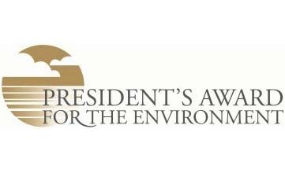
            

              

                2006
              

            

          

          

              <h2>Launch of President’s Award for the Environment</h2>
            
The President’s Award for the Environment (PAE) was launched in 2006 as Singapore's highest environmental accolade for individuals, educational institutions and organisations that have made outstanding contributions towards environment and sustainability, as well as building a resilient future for Singapore.

          

        

      
		    
	    

        

          

            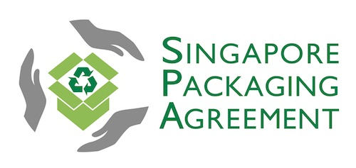
            

              

                2007
              

            

          

          

              <h2>Launch of the Singapore Packaging Agreement</h2>
            
The Singapore Packaging Agreement (SPA) was launched on 5 June 2007 as a joint initiative by government, industry, and non-governmental organisations to reduce packaging waste. The SPA was a voluntary initiative that offered signatories the flexibility to adopt cost-effective solutions to reduce packaging waste.

          

        

      

	    

        

          

            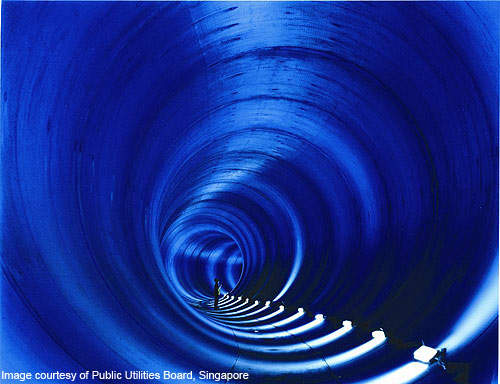
            

              

                2008
              

            

          

          

              <h2>Completion of Deep Tunnel Sewerage System Phase 1</h2>
            
Completed in 2008 at a cost of SGD$3.4 billion, Phase 1 of the DTSS comprises a 48 km-long deep sewer tunnel running from Kranji to Changi, a centralised water reclamation plant at Changi, two 5 km-long deep sea outfall pipes and 60km of link sewers.

          

        

      
	    

        

          

            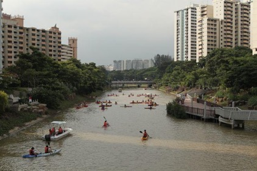
            

              

                2008
              

            

          

          

              <h2>Opening of Singapore's First ABC Waters Project</h2>
            
Kolam Ayer ABC Waterfront, the first project launched under the Active, Beautiful, Clean (ABC) Waters Programme, was officially opened to the public on 5 April 2008. The aim of the ABC Waters Programme was to transform waterways and reservoirs in Singapore beyond their basic drainage and water storage functions, to allow these spaces to be used for community bonding and recreation.

          

        

      
	    
	

        

          

            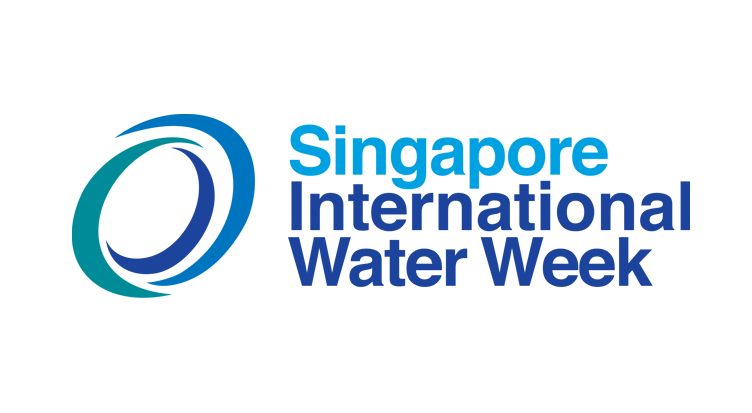
            

              

                2008
              

            

          

          

              <h2>Creation of Singapore International Water Week</h2>
            
The Singapore International Water Week (SIWW) is a global premier platform to share and co-create innovative water solutions. The biennial event gathers stakeholders from the global water industry to share best practices, showcase the latest technologies and tap business opportunities. SIWW is part of the strategic programme of the Singapore Government to grow the water industry and develop water technologies.

          

        

      
	    
	    
	    

        

          

            
            

              

                2008
              

            

          

          

              <h2>Introduction of the Mandatory Energy Labelling Scheme</h2>
            
The Mandatory Energy Labelling Scheme (MELS) was introduced on 1 January 2008 for regulated goods to help consumers compare the energy efficiency and make more informed purchasing decisions. The objective of setting Minimum Energy Performance Standards (MEPS) is to raise the average energy efficiency of regulated goods in the market.

          

        

      
	

        

          

            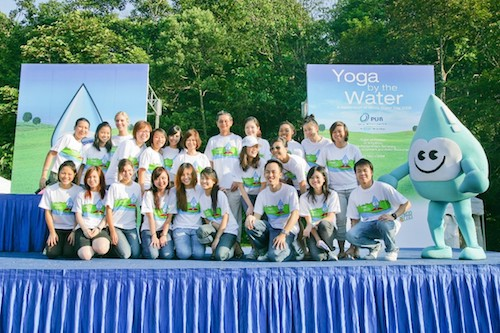
            

              

                2008
              

            

          

          

              <h2>Commencement of Singapore World Water Day</h2>
            
Singapore World Water Day (SWWD) started in 2008 and has grown to be. celebrated across the island throughout the month of March as a platform to encourage initiatives by the community for the community to celebrate water, appreciate water and raise awareness on water conservation

          

        

      
		    
	    
	    

        

          

            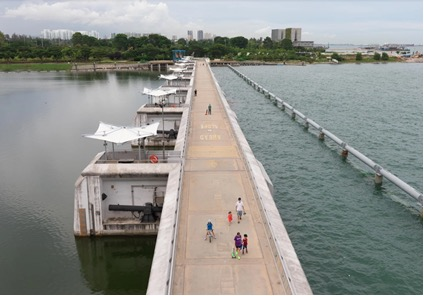
            

              

                2008
              

            

          

          

              <h2>Opening of Marina Barrage</h2>
            
Officially opened on 31 October 2008, Marina Barrage (MB) was Singapore’s 15th reservoir, and the first in the heart of the city. With a catchment area of 10,000 hectares, Marina catchment is the island’s largest and most urbanised catchment. Together with two other reservoirs, Marina Reservoir has increased Singapore’s water catchment from half to two-thirds of the country’s land area.

          

        

      
		    

        

          

            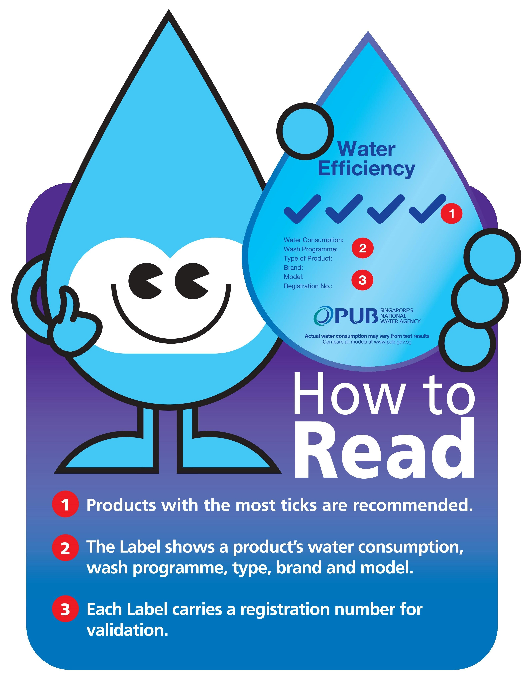
            

              

                2009
              

            

          

          

              <h2>Introduction of the Mandatory Water Efficiency Labelling Scheme</h2>
            
Started in 2009, the Mandatory Water Efficiency Labelling Scheme (Mandatory WELS) is a grading system with 0/1/2/3 tick rating denoting the water efficiency level of a product. This is a follow-up scheme from the Voluntary Water Efficiency Labelling Scheme (Voluntary WELS) introduced in 2006. The WELS helps consumers choose their products such as taps, flushing cisterns, urinals, washing machines, dishwashers etc. wisely. The mandatory scheme helps expand the range of higher efficiency products in the market and makes them more affordable.

          

        

      
	    
	    
	    

        

          

            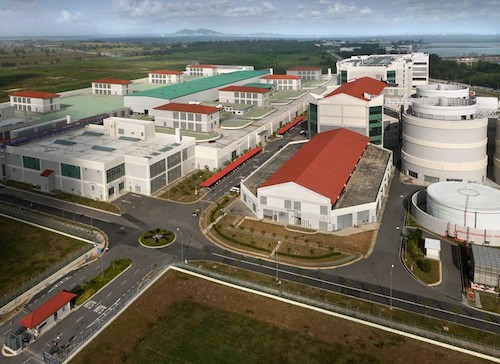
            

              

                2009
              

            

          

          

              <h2>Opening of the Changi Water Reclamation Plant</h2>
            
Opened on 23 June 2009, the Changi Water Reclamation Plant (Changi WRP) treats used water by effectively removing the solids and nutrients that are present in the used water. After treatment, the treated used water is safe to be returned to the environment or channelled to NEWater factory to be further treated into highly purified NEWater. The project was conceived in the mid-1990s and took fifteen years to complete.

          

        

      
		    

	    

        

          

            
            

              

                2009
              

            

          

          

              <h2>Launch of the First Sustainable Singapore Blueprint</h2>
            
First released in 2009, the Sustainable Singapore Blueprint (SSB) maps out strategies for Singapore’s sustainable development.

          

        

      
	
	    

        

          

            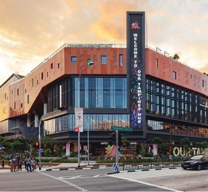
            

              

                2011
              

            

          

          

              <h2>Re-commencement of building of new Hawker Centres</h2>
            
The Government announced that it will restart the programme of building new hawker centres after a hiatus of 26 years. It was announced that 10 new hawker centres will be built over the next 10 years, focusing on HDB towns currently facing an under-provision of eating options, subject to land availability. 

          

        

      
		    

        

          

            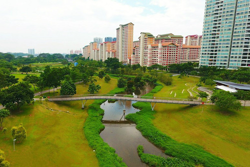
            

              

                2012
              

            

          

          

              <h2>Official opening of Bishan-AMK Park - flagship ABC Waters project</h2>
            
On 17 March 2012, the Bishan-Ang Mo Kio Park was officially reopened following a major revamp project by PUB and NParks. One drastic change was the transformation of a concrete canal into a picturesque river teeming with life. Under the ABC Waters Programme, a combination of plants, natural materials such as rocks, and civil engineering techniques were introduced to soften the edges of the waterway, give it a natural appearance and prevent soil erosion. The project saw techniques known as soil bio-engineering being used for the first time in Singapore.

          

        

      
		    

        

          

            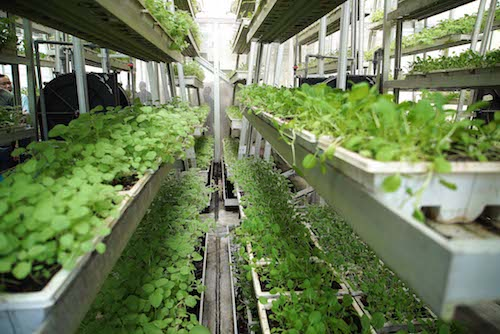
            

              

                2012
              

            

          

          

              <h2>First vertical farm commercialised</h2>
            
With technical assistance in horticulture and plant health management from AVA, Sky Greens, the world’s first vertical vegetable farm was opened in Oct 2012.

          

        

      
	
	    

        

          

            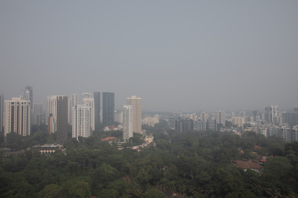
            

              

                2014
              

            

          

          

              <h2>Enactment of Transboundary Haze Pollution Act (THPA)</h2>
            
To provide for strong legal action to be taken against conduct that causes or contributes to haze pollution in Singapore, given the experience with serious haze pollution episodes, including the one in Jun 2013, Singapore enacted the THPA.

          

        

      
	
	    

        

          

            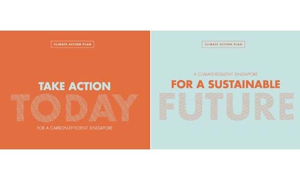
            

              

                2016
              

            

          

          

              <h2>Launch of Climate Action Plan</h2>
            
Singapore launched our Climate Action Plan in July 2016 which details our strategies to adapt to the impact of climate change, such as implementing coastal and infrastructure protection measures.

          

        

      
		    
	    

        

          

            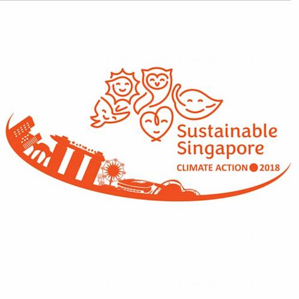
            

              

                2018
              

            

          

          

              <h2>Year of Climate Action </h2>
            
Singapore designated 2018 as the Year of Climate Action, to raise public awareness on the need to take collective action to fight climate change. A Climate Action SG Pledge was launched in January 2018 for individuals and organisations to make a public commitment to take climate action. The Climate Action SG Alliance was also set up to develop new initiatives to rally the public to climate action.

          

        

      
			    
	    

        

          

            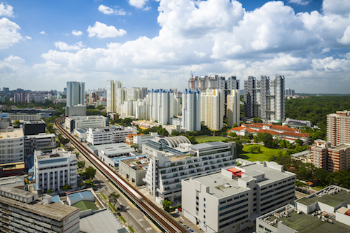
            

              

                2018
              

            

          

          

              <h2>Introduction of Carbon Pricing Act</h2>
            
Singapore is the first country in Southeast Asia to introduce a carbon price. The carbon tax, at S$5 per tonne of greenhouse gas emissions, was introduced in 2019 through the Carbon Pricing Act (CPA). The carbon tax will incentivise emissions reductions across all sectors and support the transition to a low-carbon economy. There are no exemptions for covered facilities, to maintain a transparent, fair, and consistent price signal across the economy.

          

        

      
	
	    

        

          

            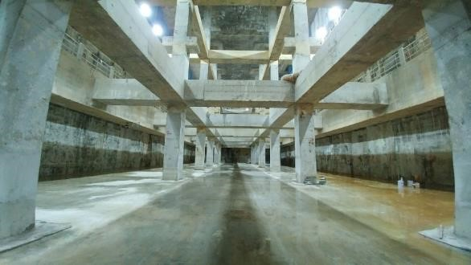
            

              

                2018
              

            

          

          

              <h2>Completion of Stamford Diversion Canal and Stamford Detention Tank</h2>
            
As part of Singapore’s climate adaptation efforts, the Stamford Diversion Canal and Stamford Detention Tank were completed in 2018 to strengthen existing flood protection and climate adaptation measures.

          

        

      
	
	    

        

          

            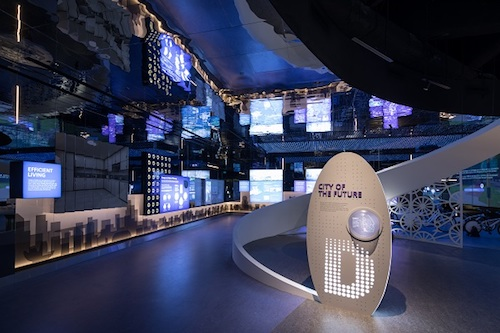
            

              

                2018
              

            

          

          

              <h2>Launch of Sustainable Singapore Gallery</h2>
            
On 1 June 2018, the Sustainable Singapore Gallery was launched. The futuristic gallery features a plethora of digital displays and interactive elements, providing an overview of Singapore's commitment to sustainable development.

          

        

      
	

        

          

            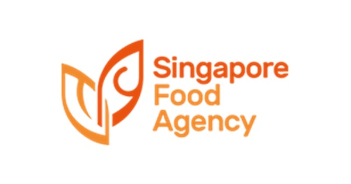
            

              

                2019
              

            

          

          

              <h2>Formation of SFA</h2>
            
The Singapore Food Agency (SFA) was formed on 1 April 2019 to strengthen food security and safety from farm to fork. SFA’s formation consolidates all the food-related expertise from the then-Agri-food and Veterinary Authority, National Environment Agency, and Health Sciences Authority into a single entity. Through consolidating resources, SFA would be able to enhance regulatory oversight along the entire food supply chain, and streamline processes for food safety. The ambitious 30 by 30 goal to produce 30 per cent of Singapore’s nutritional needs by 2030 was also established this year. 

          

        

      
		    
	    
	    

        

          

            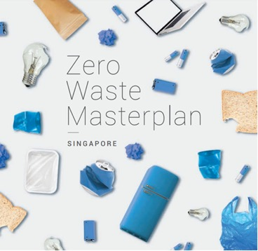
            

              

                2019
              

            

          

          

              <h2>Year Towards Zero Waste</h2>
            
Singapore has designated 2019 as the Year Towards Zero Waste. On 30 August 2019, Singapore's inaugural Zero Waste Masterplan which maps out Singapore's key strategies to build a sustainable, resource-efficient and climate-resilient nation was launched. 

          

        

      
	
	    

        

          

            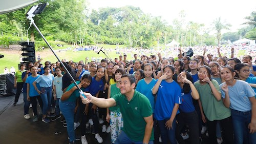
            

              

                2019
              

            

          

          

              <h2>Climate Action Week</h2>
            
Following the successful conclusion of the Year of Climate Action in 2018, Climate Action Week was initiated to rally stakeholders and citizens to take collective climate action and secure a sustainable future for Singapore.

          

        

      

        

          

            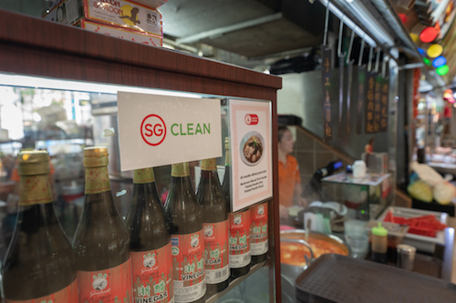
            

              

                2020
              

            

          

          

              <h2>Launch of SG Clean</h2>
            
Launched on 16 February 2020, the SG Clean campaign seeks to rally stakeholders and members of the public to do their part, by adopting good personal habits and social responsibility, to raise standards of cleanliness and public hygiene in Singapore and safeguard public health.

          

        

      
	    

	   

        

          

            
            

              

                2020
              

            

          

          

              <h2>Launch of 2020: Singapore Food Story campaign</h2>
            
The Singapore Food Story was launched amidst concerns about global supply chain disruptions stemming from the COVID-19 pandemic, and the longer-term effects of climate change on the resilience of our food supply. To ensure a safe, diversified and secure food supply for Singapore, SFA launched the 30 by 30 Express grant call to support the growth of local agri-food enterprises and accelerate the ramp up in local food production.

          

        

      
		    

        

          

            
            

              

                2020
              

            

          

          

              <h2>PUB appointed as Singapore’s national coastal protection agency</h2>
            
PUB assumed an additional role as the nation’s coastal protection agency with the mandate of safeguarding Singapore’s coastline against the threat of rising sea levels.

          

        

      
		    
	    
	    

        

          

            
            

              

                2020
              

            

          

          

              <h2>Launch of tender for HDB MSCP rooftop farming sites</h2>
            
Availing more spaces in land-constrained Singapore for commercial farming, including alternative spaces like HDB's muli-storey car park (MSCP) rooftops, is one of the strategies SFA has undertaken towards our 30-by-30 goal. As a start, SFA launched a tender for 9 HDB MSCP rooftop sites for urban farming.

          

        

      
		    
	    

        

          

            
            

              

                2020
              

            

          

          

              <h2>Launch of SG Fresh Produce logo</h2>
            
The SG Fresh Produce logo was introduced in June 2020 to help consumers easily identify local produce. Over 2,000 members of the public, local farmers, retailers and industry associations participated in the co-creation process of the logo, which was part of efforts to increase consumer awareness of local produce.

          

        

      
		    
	    

        

          

            
            

              

                2020
              

            

          

          

              <h2>First Citizens’ Workgroup to increase consumer demand for local produce</h2>
            
To increase consumer demand for local produce, and as part of the SG Together movement, MSE and SFA convened a Citizen’s Workgroup in July 2020 to co-create and co-deliver solutions to encourage greater support for local produce. Several recommendations are currently being piloted.

          

        

      
		    

	    

        

          

            
            

              

                2020
              

            

          

          

              <h2>MEWR was renamed MSE</h2>
            
On 27 July 2020, MEWR was renamed Ministry of Sustainability and the Environment (MSE) to better reflect the Government’s emphasis on sustainability, and its plans to press on with major initiatives in carbon mitigation, coastal protection, zero waste and circular economy, as well as food and water security. MSE will also continue to work with international partners to collectively address global climate and sustainability challenges.

          

        

      

        

          

            
            

              

                2020
              

            

          

          

              <h2>Resource Sustainability Act</h2>
            
The Resource Sustainability Act is an integral part of Singapore’s strategy to build a sustainable, resource-efficient and climate-resilient nation. The Act gives legislative effect to regulatory measures targeting the three priority waste streams of e-waste, food waste and packaging waste, including plastics. 

          

        

      
		    
	    

        

          

            
            

              

                2020
              

            

          

          

              <h2>The Lim Chu Kang Masterplan</h2>
            
SFA announced plans to embark on an exercise to master plan the Lim Chu Kang area into a high-tech agri-food zone that can raise food production in a sustainable and resource-efficient manner. As part of the master planning exercise, a six-month series of engagements were conducted in 2021  for stakeholders to identify and discuss ideas to co-create the future of the Lim Chu Kang region and redevelop Lim Chu Kang into Singapore’s flagship agri-food production hub of the future that is vibrant, innovative, sustainable, and accessible to all. The ideas from these engagements will be folded into the planning phase of the master planning exercise.

          

        

      
	
	    
	    
	    

        

          

            
            

              

                2020
              

            

          

          

              <h2>SG Eco Fund</h2>
            
The $50 million SG Eco Fund was launched in November 2020 by MSE to support ground-up projects that involve the community and advance environmental sustainability in Singapore. Project topics included climate change mitigation, waste reduction, as well as the conservation of nature and biodiversity. 

          

        

      

    
	    

        

          

            
            

              

                2020
              

            

          

          

              <h2>World’s first regulatory approval for cultured meat</h2>
            
To ensure the safety of novel food, SFA developed a novel food regulatory framework, which requires novel food products to be put through a pre-market safety assessment before they are allowed for sale. In Dec 2020, SFA became the first food safety authority in the world to allow a novel food product to be sold, following scientific assessment and food safety laboratory tests.

          

        

      
		    
	    
	    
	    

        

          

            
            

              

                2020
              

            

          

          

              <h2>Singapore's Hawker Culture Attains UNESCO Status</h2>
            
On 16 December 2020, Hawker Culture in Singapore was successfully inscribed as Singapore’s first element on the UNESCO Representative List of the Intangible Cultural Heritage of Humanity, with the unanimous support of the Intergovernmental Committee for the safeguarding of intangible cultural heritage. The inscription reflected our Hawker Culture’s significance in Singaporeans’ multicultural identity as a people, and as a nation, and affirms our commitment to safeguard it for future generations. 

          

        

      

	    

        

          

            
            

              

                2021
              

            

          

          

              <h2>Launch of Singapore Green Plan 2030</h2>
            
The Singapore Green Plan 2030 was unveiled on 10 February 2021. It is a whole-of-nation movement to advance Singapore's national agenda on sustainable development. The Green Plan charts ambitious and concrete targets over the next 10 years, strengthening Singapore's commitments under the UN's 2030 Sustainable Development Agenda and Paris Agreement, and positioning us to achieve our long-term net-zero emissions aspiration as soon as viable.

          

        

      

	    

        

          

            
            

              

                2021
              

            

          

          

              <h2>Launch of FRESH</h2>
            
The Future Ready Food Safety Hub (FRESH), a collaboration between Nanyang Technological University, the Singapore Food Agency, and A*STAR, was launched to build Singapore’s capabilities in food safety science. FRESH aims to drive food safety research under the Sisngapore Food Story R&D Programme. It is also tasked with helping build local food safety science capabilities in support of Singapore’s growing food innovation ecosystem.

          

        

      
		    
	    

        

          

            
            

              

                2021
              

            

          

          

              <h2>Launch of ACT Fund</h2>
            
SFA launched a $60 million Agri-Food Cluster Transformation (ACT) Fund to support the transformation of the agri-food sector into one that is highly productive, climate resilient and resource efficient. The ACT Fund replaces the 2014 Agriculture Productivity Fund and comprises three co-funding components for local food-producing companies to build and expand their production capacities and capabilities: (a) Technology Upscaling; (b) Innovation and Test-bedding; and (c) Capability Upgrading.

          

        

      
	
	    

        

          

            
            

              

                2021
              

            

          

          

              <h2>Launch of GreenGov.SG</h2>
            
PSTLES was refreshed and renamed as GreenGov.SG in Jul 2021. Under GreenGov.SG, the public sector will continue to set more ambitious resource targets, including a carbon emissions goal, and embed environmental sustainability in our core business areas. We also aim to build a culture of sustainability among public officers. GreenGov.SG is a key enabler of the Singapore Green Plan 2030.

          

        

      

        

          

            
            

              

                2021
              

            

          

          

              <h2>Commencement of Clean Tables Initiative </h2>
            
To raise the cleanliness standards at public  dining places, NEA rolled out the Clean Tables Campaign in Feb 2021 and mandatory Clean Tables Regime in Sep 2021   to nudge diners to return their dirty crockery and trays and keep the tables clean. NEA took an advisory approach in hawker centres from 1 June to 31 August 2021, during which officers were deployed to remind diners to clear their dirty trays, crockery and litter, and visual cues such as posters and banners were progressively installed. Enforcement against table littering commenced on 1 September 2021 at hawker centres, and 1 January 2022 at coffeeshops and food courts.

          

        

      
	    
	    

        

          

            
            

              

                2021
              

            

          

          

              <h2>Start of Nationwide E-Waste Management System</h2>
            
Singapore’s first nationwide electrical and electronic waste (e-waste) management system started on 1 July 2021. The new system was introduced to make it more convenient for consumers to recycle their e-waste, while ensuring e-waste is managed effectively, efficiently and in an environmentally sustainable manner.

          

        

      

	  

        

          

            
            

              

                2021
              

            

          

          

              <h2>Official Opening of Sembcorp Tengeh Floating Solar Farm</h2>
            
PUB and Sembcorp Industries officially opened the Sembcorp Tengeh Floating Solar Farm at Tengeh Reservoir. With 122,000 solar panels spanning across 45 hecttres, the commencement of the 60 megawatt-peak (MWp) solar photovoltaic (PV) farm marks a significant step towards enduring energy sustainability in water treatment.

          

        

      

	    
	    
	    	    
	    

        

          

            
            

              

                2021
              

            

          

          

              <h2>Commencement of Environmental Sanitation Regime</h2>
            
On 30 Jul 2021, NEA launched the Environmental Sanitation (ES) Regime which specifies mandatory baseline ES standards for specified high-risk premises with vulnerable occupants and high footfall, and places greater accountability on premises managers to meet these baseline standards. Assisted by Environmental Control Coordinators (ECCs) or Environmental Control Officers (ECOs), premises managers must ensure that they have in place a sector-specific ES programme, which specifies cleaning and disinfection frequencies and protocols to address incidents involving bodily discharge.

          

        

      
	    
 

        

          

            
            

              

                2021
              

            

          

          

              <h2>SFA and IFH MOU signing</h2>
            
SFA and ISE Foods Holdings Pte Ltd (IFH) signed a Memorandum of Understanding (MOU) for IFH to develop an egg layer farm, a Day-Old-Chick hatchery, a parent stock pullet farm, and a parent stock layer farm in Singapore. This will be the 4th egg farm in Singapore and will strengthen the resilience of Singapore’s food supply and egg production capability.

          

        

      
		    
	    

        

          

            
            

              

                2022
              

            

          

          

              <h2>Launch of new series of local produce badges</h2>
            
To help consumers better identify local produce and differentiate produce from farms with quality assurance or sustainable schemes, a new series of badges featuring Singapore Fresh Produce, Singapore Good Agricultural Practice Certification, and Clean and Green Certification were launched.

          

        

      
		    
	    

        

          

            
            

              

                2022
              

            

          

          

              <h2>Singapore Aquaculture Plan</h2>
            
SFA announced plans to uplift the aquaculture industry through the Singapore Aquaculture Plan. These include unlocking new spaces through new sea space tenders and longer leases; supporting the aquaculture sector to transform into one that is highly productive, climate-resilient and resource-efficient through the use of technology and adopting appropriate farm management methods, including conducting environmental surveys and water and seabed quality surveys to better inform farm management and supporting research and innovation for sustainable tropical marine aquaculture through leveraging SFA’s Marine Aquaculture Centre.

          

        

      
	

        

          

            
            

              

                2022
              

            

          

          

              <h2>Launch of National Action Strategy on Marine Litter</h2>
            
On 5 June 2022, Singapore launched its first National Action Strategy on Marine Litter, which outlines Singapore’s commitment and measures to address both land-based and sea-based sources of marine litter.

          

        

      
		    
	    
	    

        

          

            
            

              

                2022
              

            

          

          

              <h2>MSE50</h2>
            
MSE commemorates its 50th anniversary this year with a series of meaningful activities to celebrate Singapore’s environmental milestones, and renew our commitment to build a green and resilient Singapore.

          

        

      
	    

	

	    

<em>Photo Credits: National Archives of Singapore, National Environment Agency, PUB, the national water agency and Singapore Food Agency</em>

	
<!-- container end dic -->

